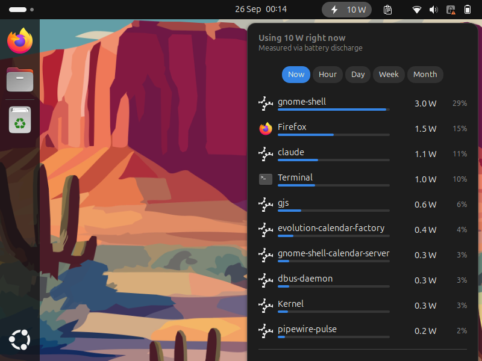

# Energy Usage Overview

> **Note:** This is a hobby project to experiment with vibe coding.

A GNOME Shell extension that shows which programs use the most energy right
now and over the last hour, day, week and month.



## How it works

There are two parts:

- **`collector/energy-usage-collector`**: a small Python script (standard library only)
  that runs as a systemd user service. Every 5 seconds it:
  1. reads the CPU time of every process from `/proc`,
  2. measures the system's power draw, using the first source that works:
     - **Intel RAPL** (`psys` or `package-0`) if the counters are readable (see below),
     - **battery discharge rate** when the laptop runs on battery,
     - otherwise an **estimate** based on CPU load (`EUO_ESTIMATE_IDLE_W` +
       load × (`EUO_ESTIMATE_MAX_W` − idle), default 4–45 W),
  3. splits the measured energy between processes based on how much CPU time each one used,
  4. groups processes into applications. It uses the systemd scopes GNOME creates
     for launched apps (so all Firefox/Chrome processes count as one app).
     Programs started from a terminal are grouped by process name.

  Data is kept in `~/.local/share/energy-usage-overview/energy.sqlite`: per-minute
  rows for 2 hours and per-hour rows for 35 days, so the history survives
  restarts and reboots (only the "now" view starts fresh). A summary is written to
  `$XDG_RUNTIME_DIR/energy-usage-overview/summary.json`.

- **`extension/`**: the GNOME Shell extension (GNOME 45+). It reads the summary,
  shows the current power in the top panel and lists the top programs for each period.

### Accuracy

The numbers are an estimate that is useful for ranking programs, not an exact
measurement. Energy is split by CPU time only, so GPU, display, disk and network
use are credited to whatever uses the CPU at the time. Processes that start and
exit between two samples (less than 5 s) are not counted.

## Install

```sh
./install.sh            # collector service + extension for the current user
./install.sh --rapl     # additionally make RAPL counters readable (needs sudo)
```

On Wayland, GNOME Shell only finds new extensions after you log in again. After
logging back in, run `gnome-extensions enable energy-usage-overview@aronwolf90.github.io`
if the extension isn't already enabled.

Command line report:

```sh
energy-usage-collector report --top 10
```

### RAPL access

Since CVE-2020-8694 ("Platypus") the kernel only lets root read the RAPL energy
counters. `--rapl` installs a udev rule that makes them readable for all users.
That lets the collector measure real CPU/platform power, including on AC power.
Only use it if you accept the side-channel risk on your machine.

## Uninstall

```sh
./uninstall.sh          # add --purge to also delete the collected history
```

## Development

Test the extension in a nested shell without logging out:

```sh
./install.sh
dbus-run-session -- gnome-shell --nested --wayland
```

Logs: `journalctl --user -u energy-usage-collector -f` and
`journalctl --user -f /usr/bin/gnome-shell`.
